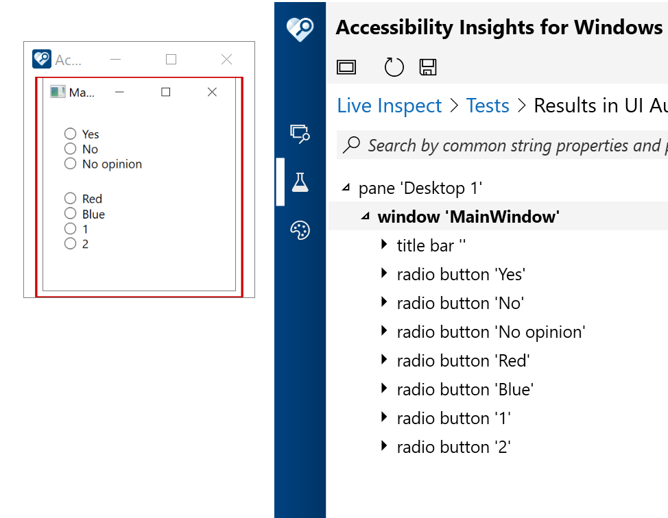
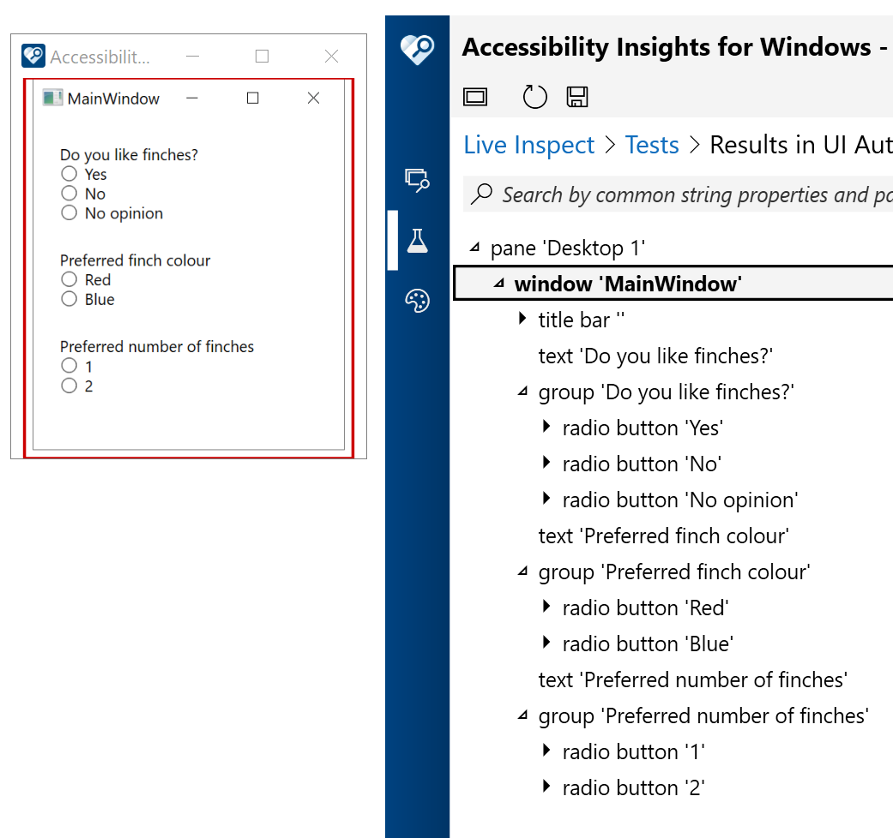

# WPF_RadioButtonGroup

Ok, this is the deal...

When your customers encounter the RadioButtons in your WPF app, they expect an intuitive and efficient experience. If you copy in the RadioButton-related code at [RadioButton Class](https://docs.microsoft.com/en-us/dotnet/api/system.windows.controls.radiobutton?view=netframework-4.8), then customers using screen readers will be made aware of the RadioButtons, but not be informed of any context. The image below shows the Accessibility Insights for Windows (AIWin) tool reporting that all the RadioButtons are just a bunch of sibling controls.

This demo app shows how to do the following:

1. Add a visual label to the RadioButton groups, so sighted customers know what they relate to.

2. Customize the StackPanel that contains each group of RadioButtons, so that customers using screen readers know that logically each set of RadioButtons is contained in a particular group.

3. Have the programmatic name of each group set from the nearby visual label.

The image below shows that with these changes, the AIWin tool reports that each group of RadioButtons is contained beneath a group whose name conveys the meaning of the group of RadioButtons.

And since we're here, I updated the app in a few more ways, should you be interested.

1. Use KeyboardNavigation.TabNavigation="Once" so that a press of tab moves keyboard focus into a group of RadioButtons, and the next press of tab takes keyboard focus out of the group. Customers never want a press of tab to move keyboard focus between RadioButtons in the same group.

2. Use KeyboardNavigation.DirectionalNavigation="Cycle" so that a press of an arrow key never moves keyboard focus out of a RadioButton group. You might choose to use "Contained" if you feel that that's what your customer would prefer. Different types of UI provide different behaviors in this regard.

3. Different types of UI also behave differently with regard to whether a RadioButton automatically gets selected when arrowing between the items. The app shows how to automatically select the RadioButton if you feel that that’s preferable for your customers.

**Please note**: In the future the default WPF behavior for RadioButtons may change. This app was created only to discuss topics which seem of interest at the time the app was written.
